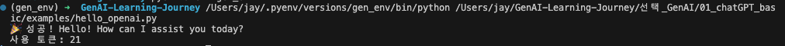
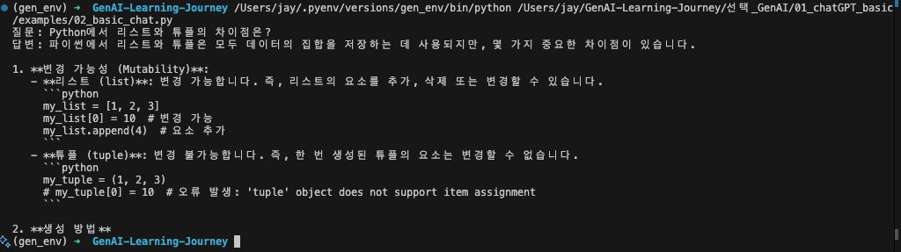
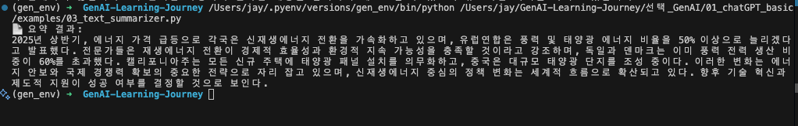
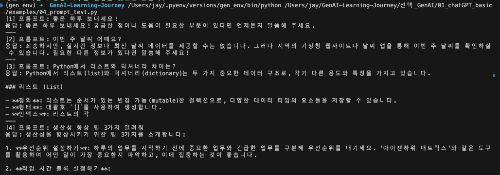
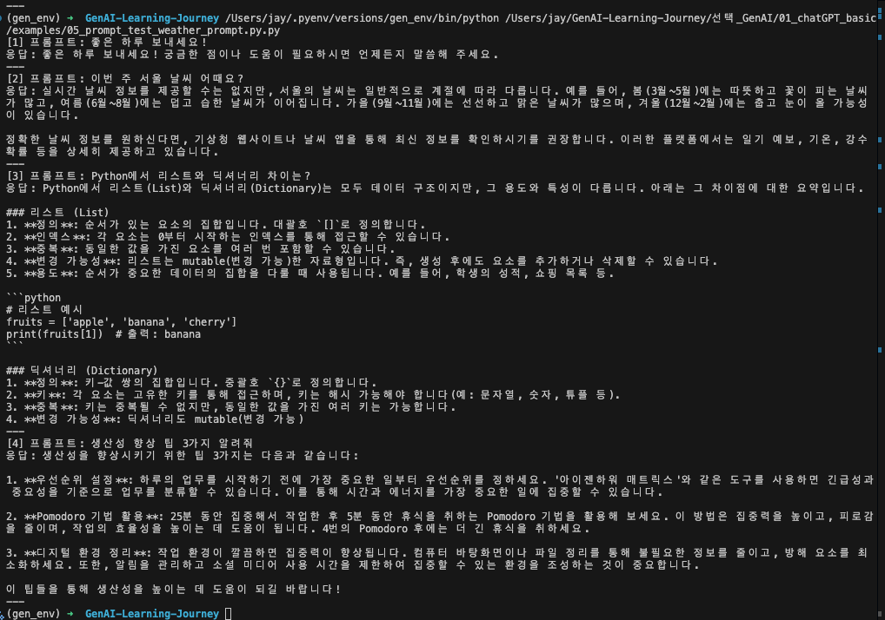
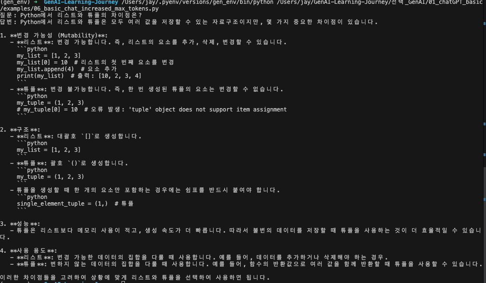
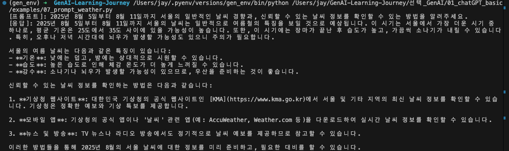

# OpenAI API 기초 실습 결과 (01~07)

> **실습 기간**: 2025-08-02  
> **사용 모델**: gpt-4o-mini  
> **주요 발견**: max_tokens 제한과 프롬프트 구체화의 중요성

---

## 📊 실습 요약

| 파일명 | 목적 | max_tokens | 결과 |
|--------|------|------------|------|
| 01_hello_openai.py | 기본 API 연결 테스트 | 50 | ✅ 성공 (21토큰 사용) |
| 02_basic_chat.py | 기본 대화 기능 | 200 | ❌ 답변 중간 잘림 |
| 03_text_summarizer.py | 텍스트 요약 | 300 | ✅ 성공적인 요약 |
| 04_prompt_experiments.py | 다양한 프롬프트 테스트 | 100 | ❌ 복잡한 답변 잘림 |
| 05_prompt_test_weather.py | 날씨 조건문 + 토큰 증가 | 350 | 🔄 부분 개선 |
| 06_basic_chat_max1000.py | 토큰 대폭 증가 | 1000 | ✅ 완전한 답변 |
| 07_weather_date_specific.py | 구체적 날짜 지정 | 300 | ✅ 개선된 날씨 답변 |

---

## 🔍 주요 발견사항

### 1. max_tokens의 영향
- **100토큰**: 거의 모든 복잡한 답변 잘림
- **200토큰**: 간단한 설명도 중간에 끊김
- **350토큰**: 일부 개선되지만 완전하지 않음
- **1000토큰**: 충분한 설명 가능

### 2. 프롬프트 구체화 효과
```
❌ "이번 주 날씨 어때요?" → 모호한 일반적 답변
✅ "2025년 8월 5일~11일 서울 날씨..." → 구체적이고 유용한 답변
```

### 3. System Message 활용
```
# 효과적인 system message 예시
{
    "role": "system",
    "content": "실시간 정보는 제공할 수 없으나, 지역과 계절 정보를 바탕으로..."
}
```

---

## 📋 상세 실습 결과

### 01. hello_openai.py
```
출력: 🎉 성공! Hello! How can I assist you today?
사용 토큰: 21
학습 포인트: 기본 API 연결 성공, 토큰 사용량 확인
```

* 

### 02. basic_chat.py (max_tokens=200)
```
질문: Python에서 리스트와 튜플의 차이점은?
문제: 변경 가능성, 생성 방법 설명 중 "2. **생성 방법**" 부분에서 끊김
원인: 200토큰으로는 상세 설명 불가능
```

* 

### 03. text_summarizer.py
```
입력: 신재생에너지 관련 긴 기사 (약 300단어)
출력: 핵심 내용 잘 요약됨 (EU 50% 목표, 독일/덴마크 60% 달성 등)
성공 요인: 요약 작업은 상대적으로 토큰 효율적
```

* 

### 04. prompt_experiments.py (max_tokens=100)
```
1. "좋은 하루 보내세요!" → ✅ 정상 (간단한 인사)
2. "이번 주 날씨 어때요?" → ✅ 실시간 정보 불가 안내
3. "Python 리스트와 딕셔너리 차이" → ❌ 설명 중 끊김
4. "생산성 향상 팁 3가지" → ❌ 2번째 팁 설명 중 끊김
```

* 

### 05. prompt_test_weather.py (max_tokens=350)
```
개선사항: 
- 날씨 키워드 감지로 system message 자동 추가
- 토큰 100→350으로 증가

결과:
- 날씨: 계절별 일반 경향 + 기상청 안내 (개선됨)
- 생산성 팁: 완전한 3가지 팁 제공 (성공)
- 리스트/딕셔너리: 여전히 중간 잘림 (한계)
```

* 

### 06. basic_chat_max1000.py 
```
동일 코드, max_tokens=1000으로 증가
결과: 리스트와 튜플 차이점 완전한 설명
- 변경 가능성, 구조, 성능, 사용 용도까지 포괄적 설명
- 코드 예시 포함한 상세한 답변
```

* 

### 07. weather_date_specific.py
```
프롬프트 개선: "2025년 8월 5일~11일 서울 날씨..."
결과: 
- 여름철 특징 (25-35도, 높은 습도)
- 소나기/뇌우 가능성 언급
- 구체적인 기상청 웹사이트, 앱 안내
- 실용적이고 유용한 정보 제공
```

* 

---

## 💡 학습된 베스트 프랙티스

### ✅ 효과적인 패턴
1. **충분한 토큰 할당**: 복잡한 설명은 최소 400-500토큰
2. **구체적 질문**: 날짜, 지역, 범위 명시
3. **적절한 system message**: 제약사항과 기대 응답 명시
4. **단계별 증가**: 토큰을 점진적으로 늘려가며 최적점 찾기

### ❌ 피해야 할 패턴
1. **과도하게 낮은 토큰**: 100-200토큰으로는 설명 한계
2. **모호한 질문**: "이번 주", "어떻게" 등 불명확한 표현
3. **일괄 처리**: 모든 질문에 동일한 토큰 할당

---

## 🔗 관련 학습 문서
- **01_openai-api-fundamentals.md**: 기본 API 구조
- **02_prompt-engineering-principles.md**: 효과적인 프롬프트 작성
- **09_prompt-debugging-optimization.md**: 토큰 최적화 전략

---

* **📅 작성일**: 2025-08-02 | **👨‍💻 실습자**: Jay

---