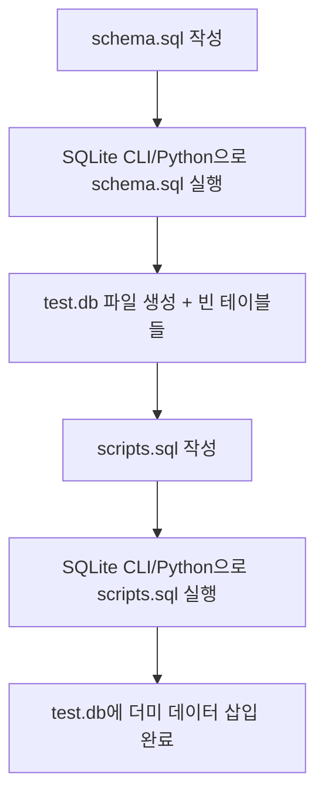

# SQLite 데이터베이스 구축 실습: schema.sql, scripts.sql, test.db

**작성일**: 2025-08-03  
**디렉터리**: `/2/`  
**학습 목표**: SQLite 파일 기반 데이터베이스 구축 과정 이해

## 📁 디렉터리 구성 개요

SQLite 데이터베이스 구축은 **3단계 파일 시스템**으로 구성:

```
/2/
├── schema.sql    # 1단계: 테이블 구조 정의
├── scripts.sql   # 2단계: 더미 데이터 삽입  
└── test.db       # 3단계: 실제 데이터베이스 파일 (결과물)
```

## 🗂️ 1. schema.sql

### **개념 및 역할**
- **SQLite 데이터베이스를 위한 테이블 정의 스크립트**
- 데이터베이스 구조(스키마)를 설정하는 용도
- 테이블 이름, 컬럼 타입, 기본키, 외래키 등 데이터 구조 설계 포함

### **작성 예시**
```sql
-- schema.sql

CREATE TABLE customers (
    id INTEGER PRIMARY KEY AUTOINCREMENT,
    name TEXT NOT NULL
);

CREATE TABLE orders (
    id INTEGER PRIMARY KEY AUTOINCREMENT,
    customer_id INTEGER NOT NULL,
    date TEXT NOT NULL,
    FOREIGN KEY (customer_id) REFERENCES customers(id)
);

CREATE TABLE products (
    id INTEGER PRIMARY KEY AUTOINCREMENT,
    name TEXT NOT NULL
);

CREATE TABLE order_items (
    id INTEGER PRIMARY KEY AUTOINCREMENT,
    order_id INTEGER NOT NULL,
    product_id INTEGER NOT NULL,
    quantity INTEGER NOT NULL,
    FOREIGN KEY (order_id) REFERENCES orders(id),
    FOREIGN KEY (product_id) REFERENCES products(id)
);
```

### **핵심 특징**
- **INTEGER PRIMARY KEY AUTOINCREMENT**: SQLite의 자동 증가 기본키
- **TEXT NOT NULL**: 텍스트 타입, 빈 값 불허
- **FOREIGN KEY**: 테이블 간 관계 정의 (참조 무결성)

### **실행 순서**
1. SQLite CLI 또는 Python 코드로 `schema.sql`을 실행하면 `test.db`에 테이블들이 생성됨

## 💾 2. scripts.sql

### **개념 및 역할**
- **schema.sql로 생성된 테이블에 데이터를 삽입하는 SQL**
- 더미 데이터(seed data)를 넣는 스크립트
- 테스트 및 개발 단계에서 실제 데이터를 흉내내기 위한 용도

### **작성 예시**
```sql
-- scripts.sql

INSERT INTO customers (name) VALUES ('홍길동'), ('김영희'), ('이철수');

INSERT INTO products (name) VALUES ('사과'), ('바나나'), ('오렌지');

INSERT INTO orders (customer_id, date) VALUES (1, '2025-08-01'), (2, '2025-08-02');

INSERT INTO order_items (order_id, product_id, quantity) VALUES 
(1, 1, 2),
(1, 2, 1),
(2, 3, 5);
```

### **데이터 삽입 전략**
- **부모 테이블 먼저**: `customers`, `products` (독립적 테이블)
- **자식 테이블 나중**: `orders`, `order_items` (외래키 참조)

### **실행 순서**
1. `test.db`가 생성된 후, SQLite 명령어로 `scripts.sql` 실행
2. 위에서 만든 테이블에 데이터가 삽입됨

## 🗄️ 3. test.db

### **개념 및 역할**
- **SQLite의 실제 데이터베이스 파일**
- `.sql` 파일(schema, scripts)을 실행해서 생성된 결과물
- 경량형 DB로 파일 기반이므로 별도 서버 없이 사용 가능

### **생성 방식**

#### **방법 1: SQLite CLI 사용**
```bash
sqlite3 test.db < schema.sql
sqlite3 test.db < scripts.sql
```

#### **방법 2: Python 코드 사용**
```python
import sqlite3

# 데이터베이스 연결
conn = sqlite3.connect("test.db")

# 스키마 실행
with open("schema.sql", "r") as f:
    conn.executescript(f.read())

# 더미 데이터 삽입
with open("scripts.sql", "r") as f:
    conn.executescript(f.read())

# 변경사항 저장 및 연결 종료
conn.commit()
conn.close()
```

### **실행 결과**
- **test.db 파일이 생성**되고, 안에 4개 테이블이 포함:
  - `customers` (고객 정보)
  - `orders` (주문 정보)  
  - `products` (상품 정보)
  - `order_items` (주문 상세)
- **예시 데이터도 함께 삽입**되어 바로 쿼리 테스트 가능

## 🔄 4. 전체 실행 흐름

### **단계별 프로세스**


### **실제 명령어 순서**
```bash
# 1단계: 디렉터리 이동
cd /GenAI-Learning-Journey/선택_GenAI/05_LLM_data_services/02_데이터_기반_서비스/2/

# 2단계: 스키마 실행 (테이블 생성)
sqlite3 test.db < schema.sql

# 3단계: 데이터 삽입
sqlite3 test.db < scripts.sql

# 4단계: 결과 확인
sqlite3 test.db "SELECT * FROM customers;"
```

## 🛠️ 5. SQLite vs MySQL 차이점

### **파일 시스템 비교**

| 구분 | SQLite | MySQL |
|------|--------|-------|
| **데이터베이스 파일** | `test.db` (단일 파일) | 서버 내 데이터베이스 |
| **서버 필요 여부** | ❌ 파일 기반 | ✅ MySQL 서버 필요 |
| **스키마 실행** | `sqlite3 test.db < schema.sql` | `mysql -u root -p test_db < schema.sql` |
| **데이터 타입** | `TEXT`, `INTEGER` | `VARCHAR(100)`, `INT` |
| **자동 증가** | `AUTOINCREMENT` | `AUTO_INCREMENT` |

### **적용 상황**
- **SQLite**: 개발/테스트, 소규모 애플리케이션, 임베디드 시스템
- **MySQL**: 프로덕션 환경, 다중 사용자, 대용량 데이터

## 📊 6. 생성된 데이터 확인

### **테이블별 데이터 조회**
```sql
-- 고객 정보
SELECT * FROM customers;
/*
id | name
1  | 홍길동
2  | 김영희  
3  | 이철수
*/

-- 상품 정보
SELECT * FROM products;
/*
id | name
1  | 사과
2  | 바나나
3  | 오렌지
*/

-- 주문 정보 (JOIN 쿼리)
SELECT c.name, o.date, p.name, oi.quantity
FROM customers c
JOIN orders o ON c.id = o.customer_id
JOIN order_items oi ON o.id = oi.order_id  
JOIN products p ON oi.product_id = p.id;
/*
홍길동 | 2025-08-01 | 사과   | 2
홍길동 | 2025-08-01 | 바나나 | 1
김영희 | 2025-08-02 | 오렌지 | 5
*/
```

## ✅ 7. 요약 및 핵심 포인트

### **3단계 파일 역할**
- **schema.sql**: 🏗️ DB 테이블 구조 정의
- **scripts.sql**: 💾 더미 데이터 삽입
- **test.db**: 📁 실제 SQLite DB 파일 (최종 결과물)

### **핵심 장점**
- **휴대성**: `test.db` 파일 하나로 전체 데이터베이스 이동 가능
- **간편성**: 별도 서버 설치 없이 바로 사용
- **버전 관리**: `schema.sql`, `scripts.sql`을 `Git`으로 관리 가능

### **주의사항**
- 외래키 제약조건으로 인해 **데이터 삽입 순서** 중요
- SQLite는 동시 쓰기 제한이 있어 **대규모 애플리케이션에는 부적합**
- **`.db` 파일은 `.gitignore`에 추가** (데이터 파일이므로)

---

**💡 실무 활용**
* 개발 초기 단계나 프로토타입에서 SQLite로 빠르게 DB 구조를 검증
* 나중에 MySQL/PostgreSQL로 마이그레이션하는 방식이 일반적

---