## 실습 순서

#### 01_ChatCPT를 활용한 챗봇

---

#### 02_데이터 기반 서비스

* 01 Pandas를 이용한 데이터 추출하기 → .1/ `main.py`, `procut_list.csv`

* 02 SQL로 DB에서 정보 추출하기 → .2/`scipts.sql`

    * 데이터베이스 스키마 설명 
      * TB_CUSTOMERS (고객 목록 테이블) - 고객에 대한 정보를 저장하는 테이블
      * 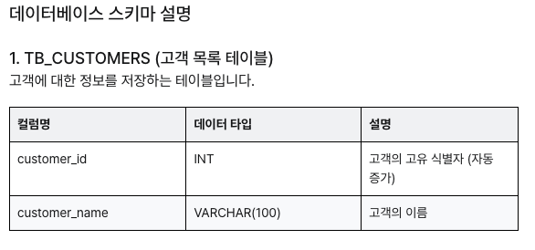

      * TB_PRODUCTS (상품 목록 테이블) - 판매되는 상품에 대한 정보를 저장하는 테이블
      * 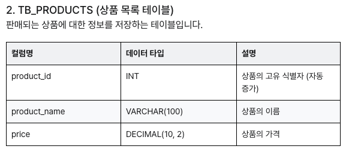

      * TB_ORDER_STATUS (주문 상태 목록 테이블) - 주문의 상태에 대한 정보를 저장하는 테이블
      * 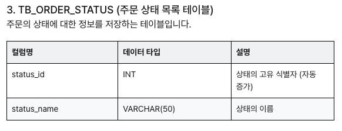

      * TB_ORDERS (주문 내역 테이블) - 고객의 주문 정보를 저장하는 테이블
      * 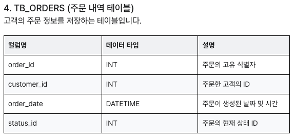

      * TB_ORDER_ITEMS (주문한 상품들 테이블) - 주문에 포함된 상품의 정보를 저장하는 조인 테이블 (다대다 관계)
      * 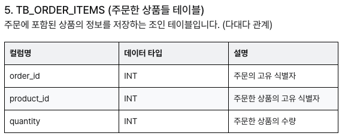

    * 파일 실습 결과
    ```sql
    Connecting to socket /var/run/mysqld/mysqld.sock, owned by user elicer
    +----------+-------------+---------------------+-------------+----------------+----------------+
    | order_id | customer_id | order_date          | status_name | products       | total_quantity |
    +----------+-------------+---------------------+-------------+----------------+----------------+
    | 1001     | 1           | 2025-08-02 04:41:57 | 상품준비중     | 상품 A, 상품 B   | 3              |
    +----------+-------------+---------------------+-------------+----------------+----------------+

    ```

* 03 파이썬에서 SQL 사용하기 - .3/`db.py`, `main.py`, `scrips.sql`
    * 코드 설명
      * `db.py` - `query_db`라는 함수 정의되어 있음 화살표 → SQL 쿼리를 입력받아 실행하고 그 결과를 반환
      * `query_db 함수` → `SQL 쿼리`를 `실행`하고 그 `결과`를 `출력`하기
      * `script.sql` → 쿼리 저장되어 있음 → 파일을 열어 쿼리를 복사 → `query_db` 함수에 전달

    * 데이터베이스 스키마 설명
      * TB_CUSTOMERS (고객 목록 테이블) - 고객에 대한 정보를 저장하는 테이블
      * 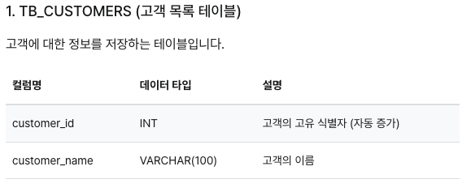

      * TB_PRODUCTS (상품 목록 테이블) - 판매되는 상품에 대한 정보를 저장하는 테이블
      * 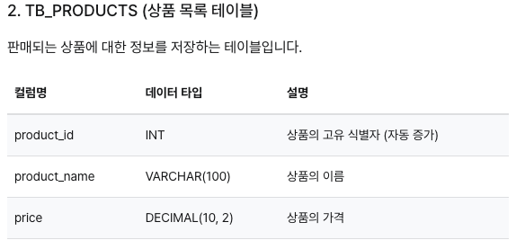

      * TB_ORDER_STATUS (주문 상태 목록 테이블) - 주문의 상태에 대한 정보를 저장하는 테이블
      * 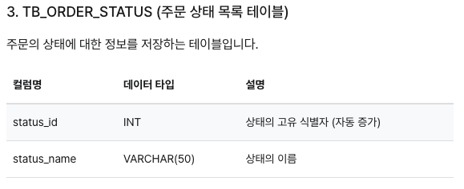

      * TB_ORDERS (주문 내역 테이블) - 고객의 주문 정보를 저장하는 테이블
      * 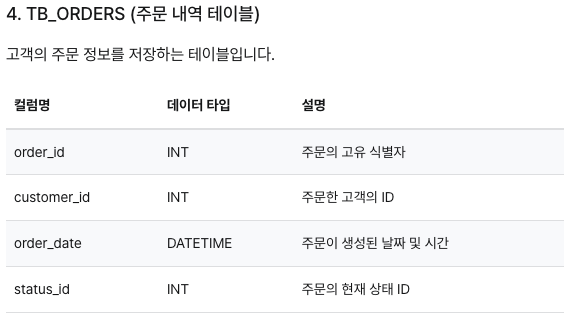

      * TB_ORDER_ITEMS (주문한 상품들 테이블) - 주문에 포함된 상품의 정보를 저장하는 조인 테이블 (다대다 관계)
      * 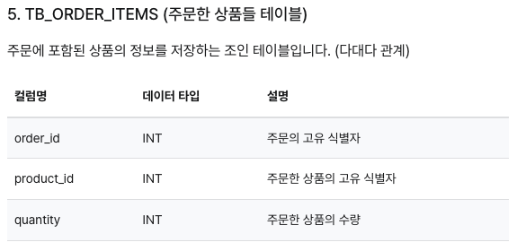

    * 출력 결과
      * 지시사항 및 결과
        * 위 테이블을 이용하여 주문번호가 1001인 주문의 상태를 확인하는 SQL 쿼리를 작성하기
        * 출력 결과
        ```code
        +----------+-------------+---------------------+-------------+----------------+----------------+
        | order_id | customer_id | order_date          | status_name | products       | total_quantity |
        +----------+-------------+---------------------+-------------+----------------+----------------+
        | 1001     | 1           | 2024-10-18 05:53:42 | 상품준비중     | 상품 A, 상품 B   | 3              |
        +----------+-------------+---------------------+-------------+----------------+----------------+ 
        ```

      * 실제 셀 출력
        ```code
        [{'order_id': 1001, 'customer_id': 1, 'order_date': datetime.datetime(2025, 8, 2, 5, 8, 40), 'status_name': '상품준비중', 'products': '상품 A, 상품 B', 'total_quantity': Decimal('3')}]
        ```

* 04 `SQL`과 `ChatGPT` -.4/`DB_SCHEMA.txt`, `db.py`, `main.py`

  * 지시사항
    * `DB_SCHEMA.txt` 파일을 읽어서 DB_SCHEMA 변수에 저장하기
        * `DB_SCHEMA.txt`에는 데이터베이스 스키마 정보가 포함되어 있음
        * 이 파일을 읽어서 `DB_SCHEMA 변수`에 저장하기
  
    * `query_db_info` 에 `parameters` 항목을 완성하기
        * `db.py` 파일에는 `query_db_info` 변수가 정의되어 있음
        * 함수의 설명을 참고하여 `query_db_info["parameters"]["properties"]`를 완성하기
        * `str 타입`은 `string`으로, `int 타입`은 `integer`로 기록하기
        * 설명은 `description` 항목에 기록하기
        * 예시
        ```<python>
        # query_db_info의 parameters 구성 예시

        {
        "type": "object",
        "properties": {
        "매개변수1이름": {
        "type": "매개변수1의 타입",
        "description": "매개변수1의 설명"
        }
        },
        "required": ["query"],
        "additionalProperties": False
        }

        ```

  * 데이터베이스 스키마 설명
      * TB_CUSTOMERS (고객 목록 테이블) - 고객에 대한 정보를 저장하는 테이블
      * 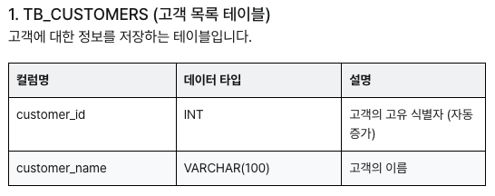

      * TB_PRODUCTS (상품 목록 테이블) - 판매되는 상품에 대한 정보를 저장하는 테이블
      * 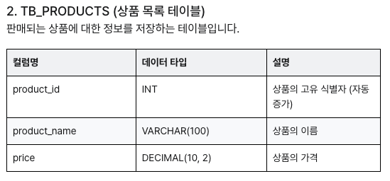

      * TB_ORDER_STATUS (주문 상태 목록 테이블) - 주문의 상태에 대한 정보를 저장하는 테이블
      * 

      * TB_ORDERS (주문 내역 테이블) - 고객의 주문 정보를 저장하는 테이블
      * 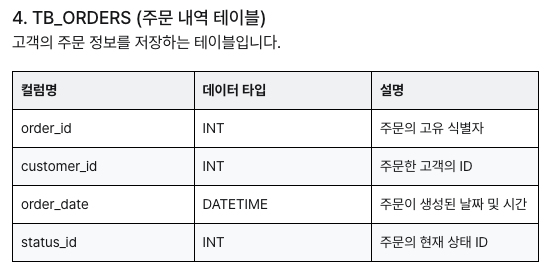

      * TB_ORDER_ITEMS (주문한 상품들 테이블) - 주문에 포함된 상품의 정보를 저장하는 조인 테이블 (다대다 관계)
      * 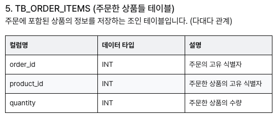

  * 실행 결과 에시 (강의 화면)
    * 결과_1 - 베송 현황

    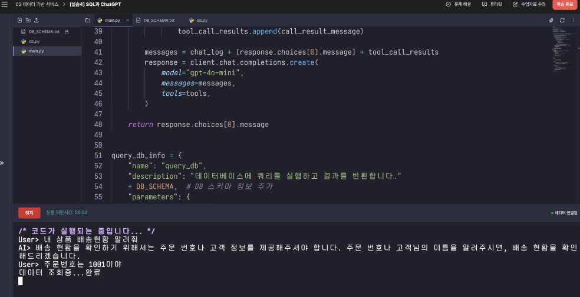

    * 결과_2 - 주문 번호

    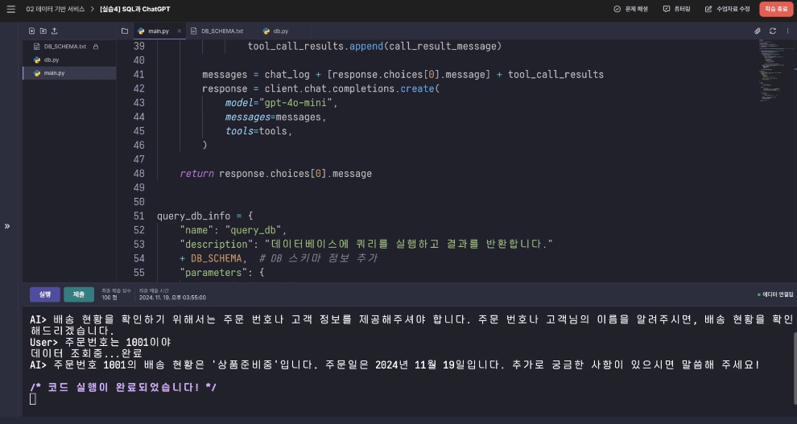


* 05 웹 크롤링 - .5/`main.py`, `utils.py`, `web.py`
  * 코드 설명
    * `utils.py`: 함수의 docstring을 해석 → `JSON 스키마`로 `변환`하는 함수를 제공
    * `web.py`: `웹 검색`을 위한 `함수`를 제공
    * `main.py`: 챗봇의 **메인 코드**
  
  * 실행 예시

    ```<plaintext>

    User> 오늘서울 날씨
    search_web {'query': '서울 오늘 날씨 2024-10-21'} ...done.
    AI> 오늘, 2024년 10월 21일의 서울 날씨는 다음과 같습니다:

    - **아침 최저 기온**: 9.0도
    - **낮 최고 기온**: 20.0도
    - 기온은 비교적 온화하며, 가벼운 외출에 적합한 날씨입니다.

    전체적으로 아침에는 쌀쌀할 수 있으니 외출 시 가벼운 겉옷을 챙기시는 것이 좋겠습니다.

    ```

  * 실제 결과

    ```<plaintext>
    /* 코드가 실행되는 중입니다... */
    User> 오늘 서울 날씨
    search_web {'query': '서울 날씨 오늘'} ...done.
    AI> 오늘 서울의 날씨는 대체로 흐리고 기온은 27°C로 예상됩니다. 바람은 시속 3.1m로 불며, 습도는 42%입니다. 세부적으로, 오늘 오후의 날씨는 매우 더운 상태로, 최고 기온은 약 34°C에 이를 것으로 보이며, 자외선 지수는 보통 수준으로 예상됩니다. 가능성을 고려할 때, 양호한 세탁 날씨로 보이는 가운데 우산은 필요하지 않을 것으로 예상됩니다.

    혹시 더 궁금한 사항이 있으신가요?
    User> 
    /* 코드 실행이 완료되었습니다! */
    ```
    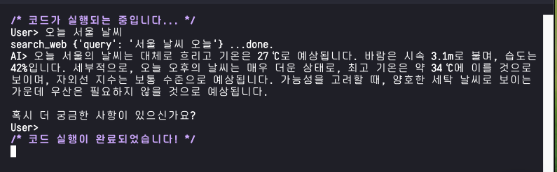

---

#### 03_RAG와 Langchain

* LangChain을 이용한 웹 검색 구현하기
    * Langchain의 웹 크롤링 툴을 사용 → 웹 크롤링 수행
    * 코드 설명
  
    ```<python>
    result = agent.invoke("어제 있었던 한국의 주요 뉴스를 요약해줘.")    
                                            # 이 부분 수정을 통해 원하는 질문을 하고 답변을 얻을 수 있음
    print(result.get("output"))
    ```
  

* 강의 중 출력 완료 화면

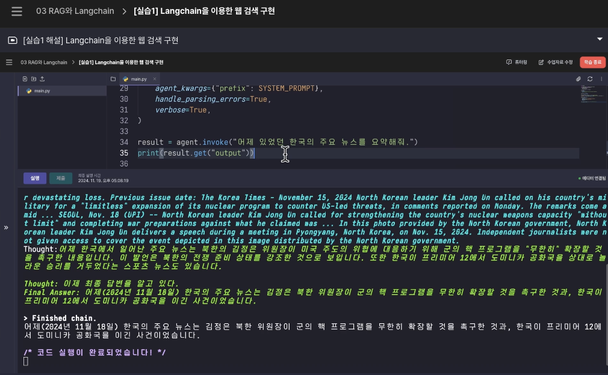

* 실제 셀 출력
    ```<plain text>

    /* 코드가 실행되는 중입니다... */
    ERROR: pip's dependency resolver does not currently take into account all the packages that are installed. This behaviour is the source of the following dependency conflicts.
    scipy 1.8.1 requires numpy<1.25.0,>=1.17.3, but you have numpy 2.2.6 which is incompatible.
    numba 0.55.2 requires numpy<1.23,>=1.18, but you have numpy 2.2.6 which is incompatible.
    /elice/project_file/main.py:25: LangChainDeprecationWarning: LangChain agents will continue to be supported, but it is recommended for new use cases to be built with LangGraph. LangGraph offers a more flexible and full-featured framework for building agents, including support for tool-calling, persistence of state, and human-in-the-loop workflows. For details, refer to the `LangGraph documentation <https://langchain-ai.github.io/langgraph/>`_ as well as guides for `Migrating from AgentExecutor <https://python.langchain.com/docs/how_to/migrate_agent/>`_ and LangGraph's `Pre-built ReAct agent <https://langchain-ai.github.io/langgraph/how-tos/create-react-agent/>`_.
    agent = initialize_agent(


    > Entering new AgentExecutor chain...
    어제 한국에서 어떤 주요 뉴스가 있었는지 확인하기 위해 검색해봐야겠다.
    Action: duckduckgo_search
    Action Input: "한국 주요 뉴스 2025-08-01"/elice/project_file/.local/lib/python3.10/site-packages/langchain_community/utilities/duckduckgo_search.py:63: RuntimeWarning: This package (`duckduckgo_search`) has been renamed to `ddgs`! Use `pip install ddgs` instead.
    with DDGS() as ddgs:

    Observation: 반도체, 조선업, 자동차, it, 배터리 등 각종 제조업 산업에서 강세를 보이는 세계 5위 규모의 제조업 강국이며, 문화 산업에 있어서도 한국 영화, 한국 드라마, k-pop, 웹툰, 한국 게임 등 다양한 … 4 days ago · 한국(韓國), 조선(朝鮮), 남북한(南北韓), 또는 코리아(영어: Korea)는 동아시아의 한반도(조선반도)에 위치한 지역 또는 나라를 지칭하는 말로, 오늘날에는 한반도와 그 부속 … 3 days ago · 대한민국(한국 한자: 大韓民國)은 동아시아의 한반도 군사 분계선 남부에 위치한 나라이다. 약칭으로 한국(한국 한자: 韓國), 별칭으로 남한(한국 한자: 南韓, 문화어: 남조선)이라 … 1 day ago · 한국일보의 인터넷 뉴스서비스 한국일보닷컴은 클린 인터넷 뉴스를 제공합니다. 한국 문화는 한류 극초기, 즉 1990년대 후반~2000년대 초반부터 일본과 중국에서 빛을 보기 시작했으며 [4], 이후 아시아와 중동에서 가능성을 확인한 뒤 성장가도를 달렸다. 그리하여 …
    Thought:이 검색 결과가 필요한 정보를 포함하고 있지 않은 것 같으니, 더 구체적으로 어제 있었던 한국의 주요 뉴스를 찾기 위해 다시 검색해야겠다.
    Action: duckduckgo_search
    Action Input: "2025년 8월 1일 한국 뉴스"/elice/project_file/.local/lib/python3.10/site-packages/langchain_community/utilities/duckduckgo_search.py:63: RuntimeWarning: This package (`duckduckgo_search`) has been renamed to `ddgs`! Use `pip install ddgs` instead.
    with DDGS() as ddgs:

    Observation: 스포츠 7.1.1. 2025 토리노 동계 세계대학경기대회 7.1.2. 2025 AFC U-20 아시안컵 중국 7.1.3. 2025 하얼빈 동계 아시안 게임 7.1.4. 2025 아프리카 U-17 네이션스컵 모로코 7.1.5. 2025 AFC U-17 아시안컵 … 1 day ago · 2025년 런던 사우스엔드공항 항공기 추락 사고가 일어났다. 키움 히어로즈 의 홍원기 와 고형욱 이 성적 부진 끝에 경질되었다. 2 days ago · The election is the first since the 2023 Gabonese coup d'état, and was preceded by a constitutional referendum in 2024. [117] April 13 – October 13 – Expo 2025 is held in Osaka, … Feb 13, 2024 · 지금까지 2025년 기준으로 법정공휴일과 법정 휴일을 반영하여 총 휴무일과 근로일수를 살펴보았습니다. 2025년 기준으로 보면 2일 근무하고 하루 휴무하는 생활 패턴입니다. 자본시장 활성화 1 고배당기업 배당소득 분리과세 도입 및 투자상생협력촉진세제 개편 2 국제결제은행 (BIS) 국내 투자소득 비과세 3 민간 벤처모펀드를 통한 벤처투자 세제지원 확대
    Thought:검색 결과가 부족하므로, 더 적합한 정보를 얻기 위해 구체적으로 어제의 한국 뉴스에 대한 정보를 다시 한번 검색해야겠다.
    Action: duckduckgo_search
    Action Input: "2025년 8월 1일 한국의 뉴스"/elice/project_file/.local/lib/python3.10/site-packages/langchain_community/utilities/duckduckgo_search.py:63: RuntimeWarning: This package (`duckduckgo_search`) has been renamed to `ddgs`! Use `pip install ddgs` instead.
    with DDGS() as ddgs:

    Observation: 스포츠 7.1.1. 2025 토리노 동계 세계대학경기대회 7.1.2. 2025 AFC U-20 아시안컵 중국 7.1.3. 2025 하얼빈 동계 아시안 게임 7.1.4. 2025 아프리카 U-17 네이션스컵 모로코 7.1.5. 2025 AFC … 1 day ago · 2025년 런던 사우스엔드공항 항공기 추락 사고가 일어났다. 키움 히어로즈 의 홍원기 와 고형욱 이 성적 부진 끝에 경질되었다. 2 days ago · The election is the first since the 2023 Gabonese coup d'état, and was preceded by a constitutional referendum in 2024. [117] April 13 – October 13 – Expo 2025 is held in Osaka, … Feb 13, 2024 · 지금까지 2025년 기준으로 법정공휴일과 법정 휴일을 반영하여 총 휴무일과 근로일수를 살펴보았습니다. 2025년 기준으로 보면 2일 근무하고 하루 휴무하는 생활 패턴입니다. 자본시장 활성화 1 고배당기업 배당소득 분리과세 도입 및 투자상생협력촉진세제 개편 2 국제결제은행 (BIS) 국내 투자소득 비과세 3 민간 벤처모펀드를 통한 벤처투자 세제지원 확대
    Thought:검색 결과가 여전히 원하는 정보를 충분히 제공하지 않고 있으므로, 더 적합한 정보를 찾기 위해 다시 한 번 검색해보겠다.
    Action: duckduckgo_search
    Action Input: "2025년 8월 1일 한국 사건 사고 뉴스"/elice/project_file/.local/lib/python3.10/site-packages/langchain_community/utilities/duckduckgo_search.py:63: RuntimeWarning: This package (`duckduckgo_search`) has been renamed to `ddgs`! Use `pip install ddgs` instead.
    with DDGS() as ddgs:

    Observation: 스포츠 7.1.1. 2025 토리노 동계 세계대학경기대회 7.1.2. 2025 AFC U-20 아시안컵 중국 7.1.3. 2025 하얼빈 동계 아시안 게임 7.1.4. 2025 아프리카 U-17 네이션스컵 모로코 7.1.5. 2025 AFC U-17 아시안컵 사우디아라비아 … 1 day ago · 2025년 런던 사우스엔드공항 항공기 추락 사고가 일어났다. 키움 히어로즈 의 홍원기 와 고형욱 이 성적 부진 끝에 경질되었다. 2 days ago · The election is the first since the 2023 Gabonese coup d'état, and was preceded by a constitutional referendum in 2024. [117] April 13 – October 13 – Expo 2025 is held in Osaka, … Feb 13, 2024 · 지금까지 2025년 기준으로 법정공휴일과 법정 휴일을 반영하여 총 휴무일과 근로일수를 살펴보았습니다. 2025년 기준으로 보면 2일 근무하고 하루 휴무하는 생활 패턴입니다. 자본시장 활성화 1 고배당기업 배당소득 분리과세 도입 및 투자상생협력촉진세제 개편 2 국제결제은행 (BIS) 국내 투자소득 비과세 3 민간 벤처모펀드를 통한 벤처투자 세제지원 확대
    Thought:검색 결과가 여전히 적절한 정보를 제공하지 않는 것 같으니, 좀 더 구체적인 키워드를 사용하여 다시 검색해야겠다.
    Action: duckduckgo_search
    Action Input: "2025년 8월 1일 한국 주요 사건 사고 뉴스"/elice/project_file/.local/lib/python3.10/site-packages/langchain_community/utilities/duckduckgo_search.py:63: RuntimeWarning: This package (`duckduckgo_search`) has been renamed to `ddgs`! Use `pip install ddgs` instead.
    with DDGS() as ddgs:

    Observation: 스포츠 7.1.1. 2025 토리노 동계 세계대학경기대회 7.1.2. 2025 AFC U-20 아시안컵 중국 7.1.3. 2025 하얼빈 동계 아시안 게임 7.1.4. 2025 아프리카 U-17 네이션스컵 모로코 7.1.5. 2025 … 2025년 런던 사우스엔드공항 항공기 추락 사고가 일어났다. 키움 히어로즈 의 홍원기 와 고형욱 이 성적 부진 끝에 경질되었다. The election is the first since the 2023 Gabonese coup d'état, and was preceded by a constitutional referendum in 2024. [117] April 13 – October … Feb 13, 2024 · 지금까지 2025년 기준으로 법정공휴일과 법정 휴일을 반영하여 총 휴무일과 근로일수를 살펴보았습니다. 2025년 기준으로 보면 2일 근무하고 하루 휴무하는 생활 패턴입니다. 자본시장 활성화 1 고배당기업 배당소득 분리과세 도입 및 투자상생협력촉진세제 개편 2 국제결제은행 (BIS) 국내 투자소득 비과세 3 민간 벤처모펀드를 통한 벤처투자 세제지원 확대
    Thought:검색 결과가 제한적이고 원하는 정보를 찾기 어려운 것 같다. 어제 한국에서 있었던 주요 사건 및 사고에 대한 보다 구체적인 정보를 찾기 위해 다시 한번 검색해보겠다.
    Action: duckduckgo_search
    Action Input: "2025년 8월 1일 한국 뉴스 사건 사고"/elice/project_file/.local/lib/python3.10/site-packages/langchain_community/utilities/duckduckgo_search.py:63: RuntimeWarning: This package (`duckduckgo_search`) has been renamed to `ddgs`! Use `pip install ddgs` instead.
    with DDGS() as ddgs:

    Observation: 스포츠 7.1.1. 2025 토리노 동계 세계대학경기대회 7.1.2. 2025 AFC U-20 아시안컵 중국 7.1.3. 2025 하얼빈 동계 아시안 게임 7.1.4. 2025 아프리카 U-17 네이션스컵 모로코 7.1.5. 2025 AFC U-17 아시안컵 사우디아라비아 … 1 day ago · 2025년 런던 사우스엔드공항 항공기 추락 사고가 일어났다. 키움 히어로즈 의 홍원기 와 고형욱 이 성적 부진 끝에 경질되었다. 2 days ago · The election is the first since the 2023 Gabonese coup d'état, and was preceded by a constitutional referendum in 2024. [117] April 13 – October 13 – Expo 2025 is held in Osaka, Japan. [118] April 13 – 2025 Ecuadorian general election: Incumbent president Daniel Noboa is re-elected for a full term. [119] Feb 13, 2024 · 지금까지 2025년 기준으로 법정공휴일과 법정 휴일을 반영하여 총 휴무일과 근로일수를 살펴보았습니다. 2025년 기준으로 보면 2일 근무하고 하루 휴무하는 생활 패턴입니다. 자본시장 활성화 1 고배당기업 배당소득 분리과세 도입 및 투자상생협력촉진세제 개편 2 국제결제은행 (BIS) 국내 투자소득 비과세 3 민간 벤처모펀드를 통한 벤처투자 세제지원 확대
    Thought:검색 결과가 불충분해 원하는 정보를 찾지 못한 것 같다. 더 많은 정보를 얻기 위해 구체적으로 한국의 사건 사고에 중점을 두고 다시 검색해보겠다.  
    Action: duckduckgo_search  
    Action Input: "2025년 8월 1일 한국 뉴스 사건 사고 주요"  /elice/project_file/.local/lib/python3.10/site-packages/langchain_community/utilities/duckduckgo_search.py:63: RuntimeWarning: This package (`duckduckgo_search`) has been renamed to `ddgs`! Use `pip install ddgs` instead.
    with DDGS() as ddgs:

    Observation: 스포츠 7.1.1. 2025 토리노 동계 세계대학경기대회 7.1.2. 2025 AFC U-20 아시안컵 중국 7.1.3. 2025 하얼빈 동계 아시안 게임 7.1.4. 2025 아프리카 U-17 네이션스컵 모로코 7.1.5. 2025 AFC … 1 day ago · 2025년 런던 사우스엔드공항 항공기 추락 사고가 일어났다. 키움 히어로즈 의 홍원기 와 고형욱 이 성적 부진 끝에 경질되었다. 2 days ago · The election is the first since the 2023 Gabonese coup d'état, and was preceded by a constitutional referendum in 2024. [117] April 13 – October 13 – Expo 2025 is held in Osaka, … Feb 13, 2024 · 지금까지 2025년 기준으로 법정공휴일과 법정 휴일을 반영하여 총 휴무일과 근로일수를 살펴보았습니다. 2025년 기준으로 보면 2일 근무하고 하루 휴무하는 생활 패턴입니다. 자본시장 활성화 1 고배당기업 배당소득 분리과세 도입 및 투자상생협력촉진세제 개편 2 국제결제은행 (BIS) 국내 투자소득 비과세 3 민간 벤처모펀드를 통한 벤처투자 세제지원 확대
    Thought:
    /* 코드 실행이 완료되었습니다! */

    ```
    * `action`, `Thought`를 통해 어떤 **과정**을 거쳐 진행되는지 **관찰 가능**

    * **주의** 
        * `ChatGPT-4o-mini`의 경우 **CoT가 무한루프**처럼 돌아가 **토큰이 많이 소모**될 수 있음 
        * 그럴 경우 `Ctnl` + `C`로 **강제 중단** (위의 경우 강제 중단한 결과)
---
